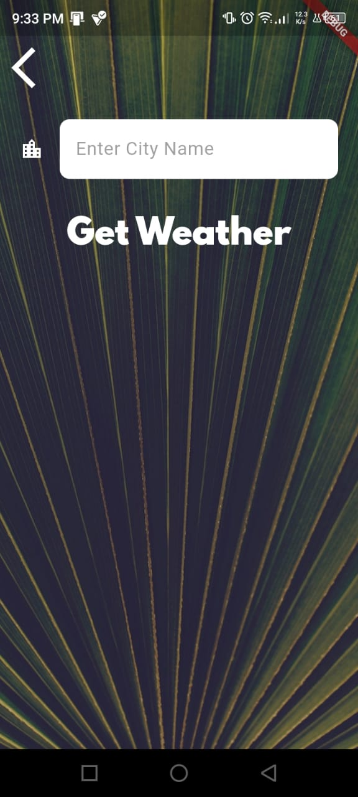

# 🌦️ Clima – Flutter Weather App

Clima is a simple and elegant weather application built with **Flutter**.
It allows users to get **real-time weather data** based on their **current location** or by **searching for a city name**, using the **OpenWeatherMap API**.

---

## 🚀 Features

* 📍 Get weather using **current GPS location**
* 🏙️ Search weather by **city name**
* 🌡️ Displays temperature in **Celsius**
* 🌤️ Dynamic weather icons and messages
* 🔄 Refresh weather data
* 🎨 Clean UI with background images
* ⏳ Loading animation while fetching data

---

## 📱 Screenshots

<p align="center">
  
  
  
  
</p>

---

## 🛠️ Technologies Used

* **Flutter**
* **Dart**
* **OpenWeatherMap API**
* **Geolocator** (for GPS location)
* **HTTP package**
* **Flutter Spinkit** (loading animation)

---

## 📂 Project Structure

```
lib/
├── screens/
│   ├── loading_screen.dart
│   ├── location_screen.dart
│   └── city_screen.dart
├── services/
│   ├── weather.dart
│   ├── networking.dart
│   └── location.dart
├── utilities/
│   └── constants.dart
└── main.dart
```

---

## 🔑 API Key Setup

This project uses the **OpenWeatherMap API**.

1. Create an account at: [https://openweathermap.org/](https://openweathermap.org/)
2. Generate your API key
3. Replace the API key in `weather.dart`:

```dart
const apikey = 'YOUR_API_KEY_HERE';
```

---

## ▶️ How to Run the Project

1. Clone the repository:

```bash
git clone https://github.com/your-username/clima-flutter.git
```

2. Navigate to the project folder:

```bash
cd clima-flutter
```

3. Install dependencies:

```bash
flutter pub get
```

4. Run the app:

```bash
flutter run
```

---

## 📌 Permissions

This app requires **location permission** to fetch weather for the current position.

Make sure location services are enabled on your device/emulator.

---

## 🎓 Learning Goals

This project helped me practice:

* Flutter navigation
* Asynchronous programming (`async/await`)
* REST API integration
* State management with `StatefulWidget`
* Location permissions handling
* Clean UI design

---

## 👤 Author

**Ghofrane BM** 
Student
📍 Tunisia 🇹🇳

📌 *This project is part of my Flutter learning journey.*

---

## ⭐ Support

If you like this project, feel free to **star ⭐ the repository**!

---
